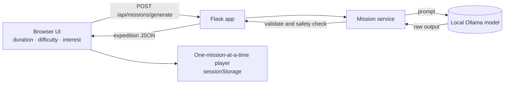

<div align="center">

# 🌿 Nature Saathi

### *Your phone is the map. The world is the classroom.*

**An AI-powered outdoor learning companion that turns an ordinary walk into a real-world nature expedition.**


-1f2937)


[Quick Start](#-quick-start) · [How It Works](#-how-it-works) · [API](#-mission-generation-api) · [Tests](#-tests) · [Roadmap](#-roadmap)

</div>

---

## 🧭 What is Nature Saathi?

*Saathi* (साथी) means **companion**. Most apps want your eyes on the screen. Nature Saathi wants them on the **sky, the soil, and the sparrow on the wall**.

Pick how long you have, how adventurous you feel, and what you're curious about. A **local AI model** writes a custom expedition for you. You read one mission, **put the phone away, go explore, come back**, and tap complete.

> 📱 **The screen should be the shortest part of the experience.**

---

## 🎮 The Expedition Loop

```text
   ┌───────────┐     ┌───────────┐     ┌───────────┐     ┌───────────┐
   │  1. PICK  │ ──▶ │  2. READ  │ ──▶ │ 3. EXPLORE│ ──▶ │ 4. RETURN │
   │ time, mood│     │ one short │     │ phone away│     │ mark it   │
   │ & interest│     │  mission  │     │ eyes up!  │     │ complete  │
   └───────────┘     └───────────┘     └───────────┘     └─────┬─────┘
         ▲                                                      │
         └──────────── next mission / review discoveries ◀──────┘
```

---

## ✨ Features

| | Feature | What it means for you |
|---|---|---|
| 🎯 | **Tailored expeditions** | Choose duration, difficulty, and interest (e.g. *Birds*) and get a fresh mission list. |
| 🧠 | **Local AI via Ollama** | Missions are generated on your own machine. No cloud AI account needed. |
| 🚶 | **One mission at a time** | Focused, phone-light flow with a progress indicator and a completion action. |
| 🔄 | **Refresh-proof runs** | Your active expedition is kept in the tab's `sessionStorage`, so an accidental refresh won't lose it. |
| 🔍 | **Review What I Discovered** | Revisit the prompts you completed once you're back. |
| 🛡️ | **Safety-aware output** | Every expedition includes a safety note, and unsafe model output is rejected. |
| 🔒 | **Private by design** | No personal notes, no uploads, no database. Closing the tab clears everything. |

---

## 🚀 Quick Start

**You need:** Python 3.9+ and [Ollama](https://ollama.com) running locally.

### 1. Get the AI ready

```bash
ollama pull gemma3:4b     # default model
ollama list               # confirm it's installed
```

### 2. Run the app

<details open>
<summary><b>🪟 Windows (PowerShell)</b></summary>

```powershell
python -m venv .venv
.venv\Scripts\Activate.ps1
python -m pip install -r requirements.txt
Copy-Item .env.example .env
python app.py
```
</details>

<details>
<summary><b>🍎 macOS / 🐧 Linux</b></summary>

```bash
python3 -m venv .venv
source .venv/bin/activate
python -m pip install -r requirements.txt
cp .env.example .env
python app.py
```
</details>

### 3. Step outside (almost)

| Where | URL |
|---|---|
| 🌍 The app | http://127.0.0.1:5000 |
| 💚 Health check | http://127.0.0.1:5000/api/health |

---

## ⚙️ Configuration

Copy `.env.example` to `.env` and adjust.

| Setting | Notes |
|---|---|
| `OLLAMA_MODEL` | Defaults to `gemma3:4b`. Set it to any locally installed text model. |
| `FLASK_DEBUG` | Set to `true` for **local development only**. |
| Host binding | The dev server binds to `127.0.0.1` by default, so it stays on your machine. |

---

## 🧩 How It Works



The mission service validates everything the model returns. Malformed, incomplete, or unsafe output never reaches the page.

---

## 🔌 Mission Generation API

### `POST /api/missions/generate`

**Request**

```json
{
  "duration_minutes": 45,
  "difficulty": "Explorer",
  "interest": "Birds"
}
```

**Success response** returns an expedition object with:

- `title`, `theme`, `duration_minutes`, `difficulty`
- `intro` and `safety_note`
- a list of `missions`, each with:

| Field | Purpose |
|---|---|
| `id` | Unique mission identifier |
| `title` | Short, catchy name |
| `task` | What to go and do |
| `observation_cue` | What to look, listen, or feel for |
| `learning_note` | The "aha" fact to take home |
| `evidence_type` | How you'll know you found it |
| `difficulty` | Mission difficulty |

**Errors** always use one shape:

```json
{ "error": { "code": "...", "message": "..." } }
```

| Status | Meaning |
|---|---|
| `400` | Invalid request |
| `503` | Ollama is unavailable |
| `502` | Model output was malformed, incomplete, or unsafe |

---

## 🗂️ Project Map

```text
nature-saathi/
├── app.py            # Flask entry point and routes
├── config.py         # Environment-driven settings
├── prompts/          # Prompt templates for the model
├── services/         # Mission generation and validation
├── templates/        # HTML pages
├── static/           # Frontend JS and CSS
├── tests/            # Python and Node test suites
├── .env.example      # Copy to .env
└── requirements.txt
```

---

## 🧪 Tests

Dependency-light, so no heavy test frameworks to install.

```bash
# Mission service checks
python -m unittest discover -s tests -v

# Frontend behavior (mocked DOM)
node tests/test_frontend_render.js
```

The frontend test covers **mission navigation, progress, completion, refresh recovery, and malformed mission data**. It is a logic check and does not replace a visual browser test.

---

## 🔐 Privacy Promise

- ✅ Runs against a **local** model
- ✅ Server binds to **localhost** by default
- ✅ State lives only in your **current tab**
- ❌ No accounts · ❌ No database · ❌ No uploads · ❌ No personal notes stored

---

## 🛠️ Troubleshooting

<details>
<summary><b>I get a 503 error when generating a mission</b></summary>

Ollama isn't reachable. Make sure it's running and the model exists: `ollama list`. If not, run `ollama pull gemma3:4b` or set `OLLAMA_MODEL` in `.env` to a model you have.
</details>

<details>
<summary><b>I get a 502 error</b></summary>

The model returned something that didn't pass validation (malformed, incomplete, or unsafe). Just try again, or switch to a more capable model via `OLLAMA_MODEL`.
</details>

<details>
<summary><b>My expedition vanished</b></summary>

Progress is stored per browser tab and cleared when the tab is closed. That's intentional for privacy.
</details>

---

## 🗺️ Roadmap

- [ ] Optional printable expedition cards, so you can leave the phone at home entirely
- [ ] More interest themes (trees, insects, clouds, night sky)
- [ ] Group and family expedition mode
- [ ] Multilingual missions (English, हिन्दी, and more)

*Ideas and contributions are welcome. Open an issue and say hello.*

---

## 🤝 Contributing

1. Fork the repo and create a branch
2. Make your change and run both test suites
3. Open a pull request describing what you improved

---

<div align="center">

**Built with 🌱 curiosity by [Shikha Shukla](https://github.com/Shikha18Shukla)**

*Now close the laptop. There's a bird out there waiting to be noticed.* 🐦

</div>
